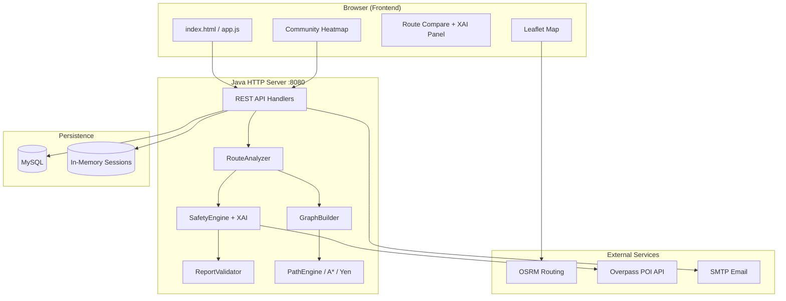

<div align="center">

# 🛡️ SafePath AI

### Safety-Aware Navigation with Explainable AI

**Plan safer routes. Track live journeys. Alert guardians in real time.**

[](https://openjdk.org/)
[](https://www.mysql.com/)
[](https://leafletjs.com/)
[](LICENSE)

[Features](#-features) · [Demo](#-demo) · [Installation](#-installation) · [Architecture](#-architecture) · [Algorithms](#-algorithms-used)

</div>

---

## 📖 Project Description

**SafePath AI** is a hackathon-grade **women's safety navigation platform** that goes beyond shortest-path routing. It combines **graph algorithms**, **OpenStreetMap POI intelligence**, and **community-sourced risk data** to recommend routes that balance distance and safety — with full **Explainable AI (XAI)** transparency for judges and users.

There is **no dependency on official NCRB/police crime datasets** at launch. Safety scores are built from a **POI + community proxy model**, with a clear **roadmap for NCRB and police open-data integration**.

> *“Don't just show Safety = 91. Show Safety = 91, Confidence = 96%, and why.”*

---

## ✨ Features

### 🗺️ Smart Routing
| Feature | Description |
|---------|-------------|
| **3 route modes** | Shortest (Dijkstra), Safest (safety-maximizing Dijkstra), Balanced (A\*) |
| **OSRM integration** | Real road geometry from OpenStreetMap via OSRM alternatives |
| **Night-time AI** | After 9 PM, automatically recommends the Safest route when competitive |
| **Route comparison panel** | Distance, safety score, algorithm, XAI confidence, and reason bullets |

### 🧠 Explainable Safety Score (XAI)
| Feature | Description |
|---------|-------------|
| **Live safety score** | 0–100 score with SAFE / MODERATE / RISKY labels |
| **Confidence %** | AI-estimated confidence from POI coverage, report density, and freshness |
| **30-min forecast** | Predicts whether a route may become riskier (night, reports, patterns) |
| **Factor breakdown** | Human-readable XAI factors in the sidebar |

### 👥 Community Intelligence
| Feature | Description |
|---------|-------------|
| **Unsafe heatmap** | Community reports visualized with risk levels |
| **Confirmed zones** | 3+ reports within ~100 m → **Confirmed** badge on heatmap |
| **Recency decay** | Reports older than 30 days count **50% less** in routing |
| **AI anomaly filter** | Rate limit (5/day), velocity spike & geo-jump detection before routing impact |
| **Zone prediction** | AI-estimated unsafe-zone probability without official crime data |

### 🚨 Safety & Guardians
| Feature | Description |
|---------|-------------|
| **Live GPS tracking** | Real-time position updates with safety recalculation |
| **Guardian dashboard** | Secure live view link (`sessionId` + `viewKey`) |
| **SOS emergency** | 3-second countdown with audible siren + guardian email alerts |
| **Journey AI monitor** | Deviation alerts, 15-min stop confirmation, risk-forecast toasts |
| **Emergency reroute** | Auto-suggest safer path when safety drops critically |
| **Safe arrival** | Trip rating feeds back into the safety model |

### 🎯 Demo & UX
| Feature | Description |
|---------|-------------|
| **One-click demo** | Full Delhi demo trip without laptop GPS — built for judges |
| **POI checkpoints** | Police, hospitals, hotels, metro, bus stops on map |
| **Trip history & reports** | Persisted in MySQL, visible in user profile |
| **Premium purple UI** | Sidebar layout, scrollable map + route panel, resizable divider |

---

## 🛠️ Tech Stack

| Layer | Technologies |
|-------|--------------|
| **Backend** | Java 11, `com.sun.net.httpserver`, JDBC |
| **Database** | MySQL 8 (users, guardians, unsafe zones, trips, email queue) |
| **Frontend** | HTML5, CSS3, Vanilla JavaScript |
| **Maps** | [Leaflet.js](https://leafletjs.com/), Leaflet.heat |
| **Routing** | [OSRM](http://project-osrm.org/) (road geometry & alternatives) |
| **POI data** | [OpenStreetMap Overpass API](https://overpass-api.de/) |
| **Auth** | Email/password, Google OAuth 2.0, password reset tokens |
| **Alerts** | SMTP email (Gmail-compatible), async email queue |
| **Audio** | Web Audio API (SOS siren) |

---

## 🏗️ Architecture



### Request flow (Plan Route)

```
User enters source & destination
        ↓
Frontend geocodes + fetches OSRM road alternatives
        ↓
POST /api/analyze-route  →  Build road graph from segments
        ↓
Dijkstra (shortest) · Dijkstra (safest) · A* (balanced)
        ↓
SafetyEngine scores each path (POI Gaussian decay + community weight)
        ↓
XAI: confidence %, 30-min forecast, reason bullets
        ↓
Route cards rendered · user selects · live tracking begins
```

---

## 🧮 Algorithms Used

| Problem | Algorithm / Technique | Implementation |
|---------|----------------------|----------------|
| Shortest path | **Dijkstra** (min distance) | `PathEngine.shortestPath()` |
| Safest path | **Dijkstra** (maximize min edge safety) | `PathEngine.safestPath()` |
| Balanced path | **A\*** (combined distance + safety heuristic) | `AStarEngine.balancedPath()` |
| Alternative routes | **Yen's k-shortest paths** (k=3) | `YenPathFinder` |
| Graph structure | **Adjacency list** (`HashMap`) | `graph/Graph.java` |
| Safety scoring | **Gaussian POI decay** + time-of-day + community penalty | `SafetyEngine.java` |
| POI proximity | Cached Overpass POI linear scan + haversine distance | `PoiFetcher.java` |
| Community zones | Haversine radius (500 m) + recency decay + confirmation weight | `UnsafeStore` + `SafetyEngine` |
| Report abuse | Rate limit, velocity spike, geo-jump anomaly detection | `ReportValidator.java` |
| XAI bundle | Confidence, forward prediction, trend classification | `SafetyInsight.java` |
| Deviation check | Point-to-polyline distance (client) | `features/deviation.js` |

### Safety score formula (simplified)

```
nodeSafety = baseScore
           + Σ (POI_weight × Gaussian(distance, σ))   ← police, hospital, metro, …
           − communityPenalty × effectiveReportWeight  ← recency × confirmation
           ± nightTimeModifier
```

---

## 📁 Folder Structure

```
safepath_realtime_fixed/
├── README.md                          ← You are here
├── START-SAFEPATH.bat                 ← Quick launcher (Windows)
├── .vscode/                           ← VS Code tasks & launch configs
│
└── safepath/
    ├── config/
    │   ├── app.properties.example     ← Config template (copy to app.properties)
    │   └── app.properties             ← Local secrets (gitignored)
    │
    ├── lib/
    │   └── mysql-connector-j.jar
    │
    ├── src/server/
    │   ├── Server.java                ← HTTP server & all API routes
    │   ├── db/Database.java           ← MySQL schema & queries
    │   ├── core/
    │   │   ├── PathEngine.java        ← Dijkstra shortest / safest
    │   │   ├── AStarEngine.java       ← A* balanced routing
    │   │   ├── YenPathFinder.java     ← K-shortest paths
    │   │   ├── RouteAnalyzer.java     ← Orchestrates 3 route picks
    │   │   ├── SafetyEngine.java      ← POI + community safety scoring
    │   │   ├── SafetyInsight.java     ← XAI analysis DTO
    │   │   └── ReportValidator.java   ← Community report anomaly AI
    │   ├── graph/                     ← Node, Edge, Graph, GraphUtils
    │   ├── models/                    ← GraphBuilder, UserSession, UnsafeLocation
    │   ├── store/                     ← SessionStore, UnsafeStore
    │   ├── services/                  ← Auth, Guardian, Email, Alerts
    │   └── util/                      ← JsonUtil, AppConfig, PoiFetcher
    │
    ├── frontend/
    │   ├── index.html                 ← Main navigation app
    │   ├── login.html / guardian.html / reset-password.html
    │   ├── app.js                     ← Core app logic, GPS, SOS, tracking
    │   ├── styles.css                 ← Premium purple theme
    │   └── features/
    │       ├── routeCompare.js        ← Route cards + XAI display
    │       ├── heatmap.js             ← Community unsafe zones
    │       ├── safetyStatus.js        ← Live score + XAI panel
    │       ├── demo.js                ← One-click judge demo
    │       └── deviation.js           ← Route deviation detection
    │
    ├── run.bat / run.ps1 / run.sh     ← Build & run scripts
    └── out/                           ← Compiled .class files (gitignored)
```

---

## ⚙️ Installation

### Prerequisites

| Requirement | Version |
|-------------|---------|
| Java JDK | 11 or higher |
| MySQL | 8.0 or higher |
| Browser | Chrome / Edge / Firefox (modern) |
| Internet | Required for OSRM, OSM tiles, Overpass POIs |

### Steps

```bash
# 1. Clone the repository
git clone https://github.com/RiddhiRopalkar/SafePath_Women_Safety.git
cd SafePath_Women_Safety/safepath

# 2. Ensure MySQL is running (default port 3306)

# 3. Copy configuration template
cp config/app.properties.example config/app.properties   # Linux/macOS
# copy config\app.properties.example config\app.properties   # Windows

# 4. Edit config/app.properties — set mysql.password at minimum

# 5. Compile
javac -cp "lib/*" -d out -sourcepath src src/server/Server.java

# 6. Run
java -cp "out;lib/*" server.Server        # Windows
java -cp "out:lib/*" server.Server        # Linux/macOS
```

The server auto-creates the `safepath` database and all tables on first startup.

---

## 🔧 Configuration

Copy `safepath/config/app.properties.example` → `safepath/config/app.properties` (never commit real passwords).

### MySQL (required)

```properties
mysql.host=localhost
mysql.port=3306
mysql.database=safepath
mysql.user=root
mysql.password=your-mysql-password
```

Environment override: `SAFEPATH_MYSQL_PASSWORD`, `SAFEPATH_MYSQL_HOST`, etc.

### SMTP email (optional — guardian alerts)

```properties
smtp.host=smtp.gmail.com
smtp.port=587
smtp.user=your@gmail.com
smtp.password=your-16-char-app-password
smtp.from=your@gmail.com
smtp.ssl=false
```

Use a [Gmail App Password](https://myaccount.google.com/apppasswords) with 2FA enabled.  
Overrides: `SAFEPATH_SMTP_HOST`, `SAFEPATH_SMTP_USER`, `SAFEPATH_SMTP_PASS`

### Google Sign-In (optional)

1. [Google Cloud Console](https://console.cloud.google.com/) → Credentials → OAuth 2.0 Client ID (Web)
2. Authorized origin: `http://localhost:8080`
3. Set `google.client.id` in `app.properties`

### Server port

```properties
server.port=8080
```

---

## ▶️ Run

> **Important:** Do **not** use VS Code Live Server (port 5503). The app must be served by the Java backend on port **8080**.

| Method | Command |
|--------|---------|
| **Windows — double-click** | `safepath/run.bat` or `START-SAFEPATH.bat` |
| **PowerShell** | `.\safepath\run.ps1` |
| **Linux / macOS** | `./safepath/run.sh` |
| **VS Code** | Run task **SafePath: Run Server (port 8080)** or F5 |
| **Manual** | See [Installation](#-installation) |

Open: **http://localhost:8080/**

Health check: `http://localhost:8080/health`

---

## 🎬 Demo

### Quick judge demo (no GPS needed)

1. Open **http://localhost:8080/** and log in (or register).
2. Click **Launch One-Click Demo** in the sidebar.
3. Click **Find Route** — compare **Shortest**, **Safest**, and **Balanced** with XAI confidence.
4. Toggle **Show Unsafe Heatmap** — see Confirmed vs Unverified community zones.
5. Open **Guardians** → add a guardian → copy the live tracking link.
6. Open `guardian.html` in another tab to show the live guardian view.

### Live GPS demo

1. Click **Turn On Location** → allow browser GPS.
2. **Start Tracking** — watch the XAI sidebar update (confidence, 30-min forecast).
3. **Report Unsafe Location** — see AI anomaly filter feedback.
4. **Emergency SOS** — 3-second countdown with siren (guardian email if SMTP configured).

### Sample API — analyze route

```http
POST /api/analyze-route
Content-Type: application/json

{
  "coordinates": "[[28.6315,77.2167],[28.6129,77.2295]]",
  "mode": "WALK"
}
```

Response includes `routes.shortest`, `routes.safest`, `routes.balanced` each with `safetyScore`, `confidence`, `predictedScore30Min`, and `reasons`.

---

## 🔮 Future Scope

- [ ] **NCRB / police open-data integration** for official crime statistics layer
- [ ] **ML-based risk prediction** trained on historical trip + report data
- [ ] **Native mobile apps** (Android / iOS) with background GPS
- [ ] **SMS / push notifications** alongside email alerts
- [ ] **Multi-city POI pre-caching** for faster cold starts
- [ ] **Crowdsourced verification** with trusted-user weighting
- [ ] **Public transport safety** (bus/metro timing + crowd density)
- [ ] **Accessibility routing** (well-lit, wheelchair-friendly paths)
- [ ] **Unit & integration tests** for routing and safety engines
- [ ] **Docker Compose** one-command deployment

---

## 👥 Contributors

| Name | Role |
|------|------|
| **[Riddhi Ropalkar](https://github.com/RiddhiRopalkar)** | Project lead & repository maintainer |
| **[Siddhi Ropalkar](https://github.com/s-ropalkar)** | Project lead & repository maintainer |

> Add your name here via pull request if you contributed to SafePath AI.

---

## 📄 License

This project is licensed under the **MIT License** — see the [LICENSE](LICENSE) file for details.

```
MIT License — free to use, modify, and distribute with attribution.
```

---

<div align="center">

**Built with ❤️ for safer journeys**

*SafePath AI — Your Safety, Our Priority*

[⬆ Back to top](#️-safepath-ai)

</div>
